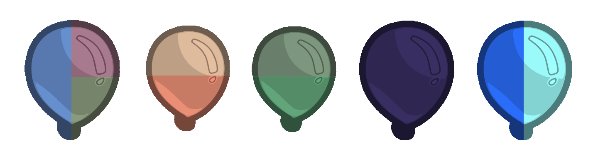

# Alternate Bloon Types
### A Bloon Set for the BTD6 Bloon Factory Mod

by Kevin / ijkx

To add new 5 Bloon types that encourage you to adapt your strategies without
disrupting the standard BTD6 rounds and balance, with a focus on rounds 1-80.

Best experienced on any Hard mode variant (except ABR or CHIMPS) - make it
challenging! Because enabling this pack only slightly increases difficulty.

## Non-Users Technical Description

This is a set of data which can be loaded by the BloonFactoryMod program in
order to modify the game BTD6.

## Installation

Dependencies:
- BloonFactoryMod.dll
- BTD6ModHelper.dll

On a legitimate installation of BTD6, follow the Modding Guide to install the
BTD6 Mod Helper (MelonLoader). Install Bloon Factory Mod.

*Option 1*: Find the Mods folder and paste the contents of the
BloonFactoryBloons subfolder into the BloonFactoryBloons subfolder.
(e.g. `C:\Program Files (x86)\Steam\steamapps\common\BloonsTD6\Mods\BloonFactoryBloons`)

*Option 2*: Import each file using the UI.

Note all names are suffixed with IJKX to avoid a conflict with other sets.

You may delete Bloon types as long as you also delete all types which depend on
them. The internal dependencies are:
- Obsidian [GlassIJKX] is a dependency for Vortex [VortexIJKX]
- Ghost [NecroIJKX & GhostFortIJKX] is a dependency for Zombie [ZombieIJKX & ZombieFortIJKX]

## Modified Rounds and New Types

Round 9
+ 2 Patchwork Bloon

~~~ Patchwork Bloons ~~~

Appearance: Dim Blue/Red/Yellow

Fabric shells in the form of Bloons. They can absorb a number of low-pierce
projectiles before popping, and are immune to explosions and ice.

* Use high-pierce projectiles to tear Patchwork Bloons apart.
* Patchwork Bloons split into multiple weaker copies on multi-lane maps!

Slow, Contains None

~~~~~~~~~~~~~~~~~~~~~~~~

Round 12
+ 10 Patchwork Bloon

Round 13
+ 1 Stun Bloon

~~~   Stun Bloons    ~~~

Appearance: Copper-coloured

When popped, Stun Bloons explode in a burst of energy, stunning nearby towers
for 4 seconds.

Fast, Contains 2x Pink

~~~~~~~~~~~~~~~~~~~~~~~~

Round 18
+ 5 Stun Bloon

Round 23
+ 7 Patchwork Bloon

Round 29
+ 9 Stun Bloon

Round 30
+ 9 Stun Bloon

Round 32
+ 12 Zombie Bloon

~~~  Zombie Bloons   ~~~

Appearance: Dim Green

Zombie Bloons are tough and take 3 damage to pop. Dashes forward when damaged.
When popped, they leave behind a Ghost that distracts Camo-seeing towers
and resurrects into a (normal) Lead Bloon after 10 seconds.

Ghosts are nearly invulnerable, since they resist 1 damage per hit. But they
will not resurrect a Lead Bloon if popped early. Ghosts are immune to ice.
Resurrected Bloons give no cash.

Moderate, Contains 1x Ghost (Lead)

~~~~~~~~~~~~~~~~~~~~~~~~

Round 33
+ 7 Camo Stun Bloon

Round 36
+ 2 Stun Bloon
+ 9 Patchwork Bloon

Round 37
+ 20 Camo Stun Bloon
+ 9 Patchwork Bloon

Round 38
+ 14 Zombie Bloon
+ 9 Patchwork Bloon

---
###    MEDIUM
---

Round 41
+ 1 Obsidian Bloon

~~~ Obsidian Bloons ~~~

Appearance: Dark Purple

Obsidian Bloons are harder than Lead and can even withstand the shot of a
Deadly Precision sniper. However, they are brittle and shatter after taking
damage no more than 10 times.

* High-damage heavy weapons are wasted on Obsidian Bloons!

Fast, Contains 2x Purple Regrow

~~~~~~~~~~~~~~~~~~~~~~~~

Round 43
+ 33 Zombie Bloon
+ 4 Stun Bloon

Round 44
+ 10 Obsidian Bloon

Round 46
+ 6 Camo Stun Bloon

Round 47
+ 24 Obsidian Bloon

Round 49
+ 18 Stun Bloon
+ 4 Camo Stun Bloon

Round 50
+ 20 Fortified Zombie Bloon

Round 53
+ 80 Obsidian Bloon

Round 55
+ 10 Stun Bloon
+ 12 Camo Stun Bloon

Round 57
+ 5 Zombie Bloon
+ 40 Fortified Zombie Bloon

---
###      HARD
---

Round 66
+ 1 Vortex Bloon

~~~  Vortex Bloons   ~~~

Appearance: Blue/Cyan

Vortex Bloons are like a Ceramic crossed with a Pink, Purple and White Bloon.
In all the bad ways. While a Vortex Bloon is on the track, all incoming Bloons
spawn with +50% bonus speed.

When at half health, is knocked back and stuns nearby towers.

Extremely Fast, Contains 2x Ceramic, 2x Obsidian

~~~~~~~~~~~~~~~~~~~~~~~~

Round 67
+ 67 Obsidian Bloon

Round 68
+ 128 Fortified Zombie Bloon

Round 70
+ 5 Vortex Bloon

Round 71
+ 250 Obsidian Bloon

Round 73
+ 5 Vortex Bloon

Round 76
+ 1 Vortex Bloon

Round 77
+ 10 Vortex Bloon

---
###   IMPOPPABLE
---
(Note: Round 80 is really the end of content)

Round 83
+ 280 Obsidian Bloon

Round 86
+ 25 Vortex Bloon
